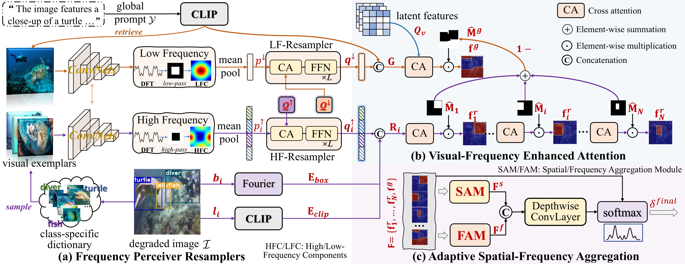
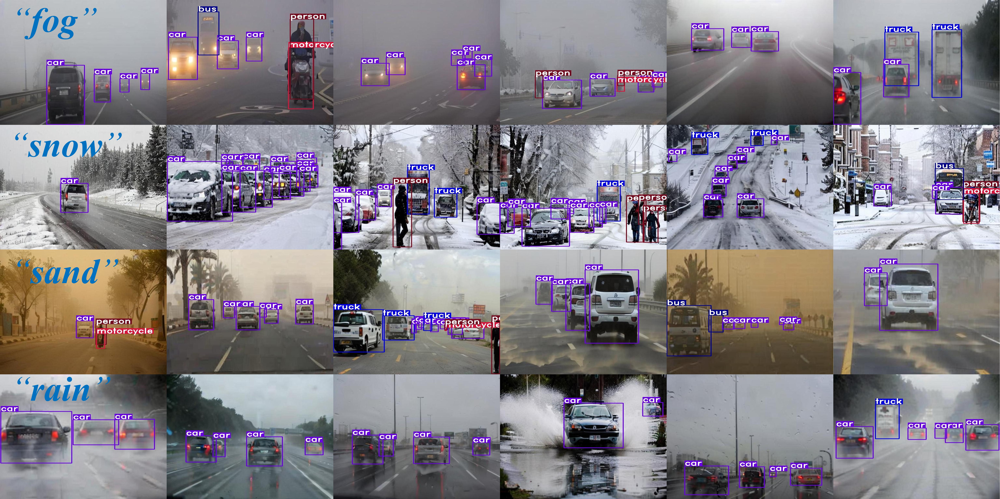

# Implementation of FICGen (ICCV 2025)

FICGen: Frequency-Inspired Contextual Disentanglement for Layout-driven Degraded Image Generation
<a href='https://arxiv.org/abs/2509.01107'></a> 
> Wenzhuang Wang, [Yifan Zhao](https://zhao1f.github.io/), Mingcan Ma, Ming Liu,  Zhonglin Jiang, Yong Chen, [Jia Li](http://cvteam.net/members/lijia/upload/index.html)
> <br>
> State Key Laboratory of Virtual Reality Technology and Systems, SCSE&QRI, Beihang University, Geely Automobile Research Institute (Ningbo) Co., Ltd


## Features
* **Motivation:**  Layout-to-image (L2I) generation has exhibited promising results in natural domains, but suffers from limited generative fidelity and weak alignment with user-provided layouts when applied to degraded scenes (i.e., low-light, underwater). We primarily attribute these limitations to the "contextual illusion dilemma" in degraded conditions, where foreground instances are overwhelmed by context-dominant frequency distributions.
* **Contribution:** We propose a new Frequency-Inspired Contextual Disentanglement Generative (FICGen) paradigm, which seeks to transfer frequency knowledge of degraded images into the latent diffusion space, thereby facilitating the rendering of degraded instances and their surroundings via contextual frequency-aware guidance. we significantly enhance **Results** (Extensive experiments on 5 benchmarks involving a variety of degraded scenarios—from severe low-light to mild blur—demonstrate that FICGen consistently surpasses existing L2I methods in terms of generative fidelity, alignment and downstream auxiliary trainability.).


## News
- **2025-11-25**: 🔥🔥🔥 Training and inference code have been released. Recommanded Hardware: at least 1x NVIDIA GeForce RTX 3090, GPUs Memory: ~24GB GPU memory.

<a id="Gallery"></a>
## Gallery
**Qualitative Comparison**

**Underwater Controllable Generation**

**Adverse Weather Controllable Generation**



<a id="Installation"></a>

- ## 1.Installation

We recommend using Python 3.8.0 and PyTorch with CUDA support. To set up the environment:

```bash
# Create a new conda environment
conda create -n ficgen python=3.8.0
conda activate ficgen

# Install other dependencies
pip install -r requirements.txt
pip mmcv-full==1.7.0
cd mmdetection
pip install -e .
```
### 2.Training preparation

**2.1 Training Data Preparation**
Take the remote sensing dataset DIOR as an example:
- Download [DIOR](https://arxiv.org/abs/1909.00133) dataset. 
- The global prompts are obtained by [BLIP-2](https://huggingface.co/docs/transformers/main/model_doc/blip-2), and the text-image similarities are obtained by [CLIP](https://github.com/openai/CLIP)(dior_emb.pt from [data_tools/CLIPmodel.py](https://github.com/fayewong666999/FICGen/data_tools/CLIPmodel.py)).
- All dataset annotations are uniformly converted into COCO format (e.g., instances_train.json in [MMDetection2.25.3](https://github.com/open-mmlab/mmdetection/tree/v2.25.3)) using [datasets/gen2coco.py](https://github.com/fayewong666999/FICGen/datasets/gen2coco.py), enabling consistent preprocessing and downstream trainability evaluation.
- The class-specific dictionary is collected from the training set ([data_tools/data_crop.py](https://github.com/fayewong666999/FICGen/data_tools/data_crop.py)) and the metadata.jsonl file for organizing the training and test data follows [datasets/data_process.py](https://github.com/fayewong666999/FICGen/datasets/data_process.py).

The final dataset should be ordered as follow:
```
DIOR
├── train
│   ├── 00001.jpg
|   ├── ...
|   ├── metadata.jsonl
├── test
|   ├── 23462.jpg
|   ├── ...
|   ├── metadata.jsonl
├── dior_emb.pt
```

### 3. FICGen Training and Inference

Train our FICGen model (Please pay attention to the image paths of the dataset):
```
bash dist_train_ficgen.sh
```
Layout-driven degraded image generation (Note to modify the checkpoint path and dataset path):
```bash
python inference.py --img_patch_path  img_patch_path_dir --bg_path bg_path_dir
```

### 4. Generative Evaluations

[4.1Fidelity(FID)](https://github.com/toshas/torch-fidelity):
```bash
pip install torch-fidelity
fidelity --gpu 0 --fid --input1 real_images_dir --input2 synthetic_images_dir
```
The resolution of both the real and synthetic images is **512x512**. It should be noted that in the process of evaluating the fidelity of remote sensing images, the Inception network has been pre-trained on RSICD. Please refer to [AeroGen](https://github.com/Sonettoo/AeroGen).

4.2 Alignment (YOLO score, AP):

We use the pre-trained YOLOv8 to calculate the AP between synthetic images (**512x512**) and ground-truth bboxes (note to modify the image path in calculate_ys.py):
```bash
cd eval
pip install ultralytics
python calculate_ys.py
```
For a comprehensive alignment evaluation, we utilize the pre-trained Faster R-CNN (R50) in [mmdetection2.25.3](https://github.com/open-mmlab/mmdetection/tree/v2.25.3) (note  to modify the **test image path in coco_detection.py**):
```bash
cd mmdetection
python tools/test.py configs/faster_rcnn/faster_rcnn_r50_fpn_1x_coco.py work_dirs/faster_rcnn_r50_fpn_1x_dior/latest.pth --eval bbox
```
**When using MMDetection for alignment evaluation, ensure that synthetic images are resized to the same resolution as their corresponding real test images.** For other datasets such as ExDARK and RUOD, the alignment evaluation methods are similar. Pay attention to the correctness of the synthetic image paths.

4.3 Trainability (downstream AP performance):

(1) We first apply augmentation to the ground-truth bboxes (**e.g., train/metadata.jsonl**) in the training set, including random flip, translation, and scaling, and then combine the original training annotations (instances_train.json) to generate new annotation files (instances_train_mix.json) in mmdetection:
```
cd datasets
python augmentation_box.py
python gen2coco.py
```
(2) We generate auxiliary training images based on the newly augmented annotations (**metadata_gen.jsonl from augmentation_box.py**) and move these synthetic images to the real training image folder::
```
cd ..
python inference.py
```
(3) For a comprehensive trainability evaluation, we utilize the pre-trained Faster R-CNN (R50) in [mmdetection2.25.3](https://github.com/open-mmlab/mmdetection/tree/v2.25.3) (note to modify **the training image and annotation path** in coco_detection.py):
```bash
cd mmdetection
bash tools/dist_train.sh configs/faster_rcnn/faster_rcnn_r50_fpn_1x_coco.py 8 --work-dir work_dirs/faster_rcnn_r50_fpn_1x_dior_mix
```
**Note that each synthesized training image should either match the resolution of its corresponding real image or, if different, correspond correctly to the augmented annotations.** For other datasets such as ExDARK and RUOD, the trainability evaluation methods are similar. Pay attention to the correctness of the synthetic image and annotation paths.

## Problems/Cooperation
- If you are interested in FICGen and wish to cooperate with us, feel free to contact us.
Reach out: **wz_wang@buaa.edu.cn**

## Acknowledgements
Our work is based on [stable diffusion](https://github.com/Stability-AI/StableDiffusion), [diffusers](https://github.com/huggingface/diffusers), [CLIP](https://github.com/openai/CLIP), [CC-Diff](https://github.com/AZZMM/CC-Diff/tree/main), [MIGC](https://github.com/limuloo/MIGC), We appreciate their excellent contributions for Layout-to-Image Generation.

## Citation
```bibtex
@inproceedings{wang2025ficgen,
  title={FICGen: Frequency-Inspired Contextual Disentanglement for Layout-driven Degraded Image Generation},
  author={Wang, Wenzhuang and Zhao, Yifan and Ma, Mingcan and Liu, Ming and Jiang, Zhonglin and Chen, Yong and Li, Jia},
  booktitle={Proceedings of the IEEE/CVF International Conference on Computer Vision},
  pages={19097--19107},
  year={2025}
}
```


